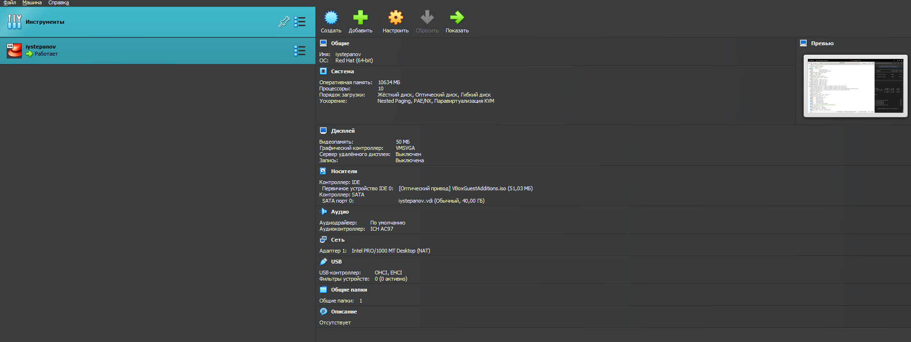
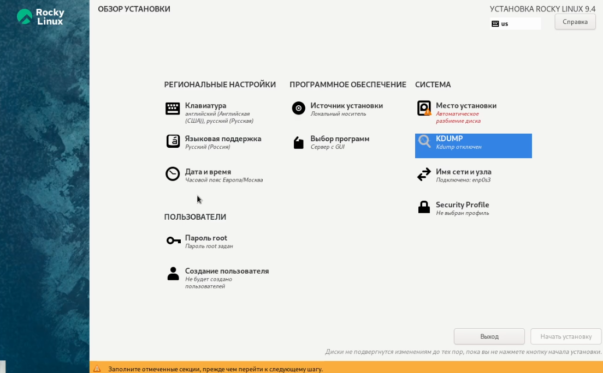
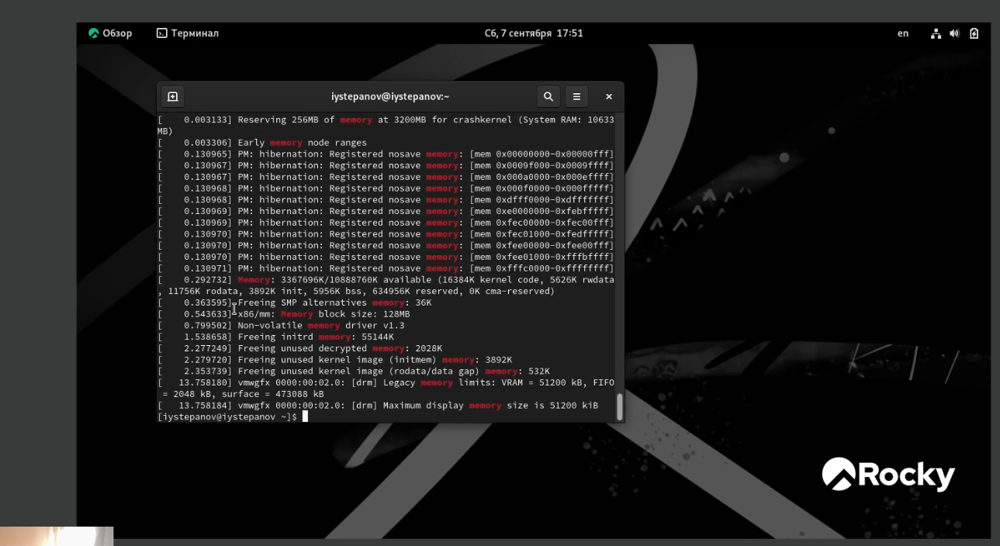
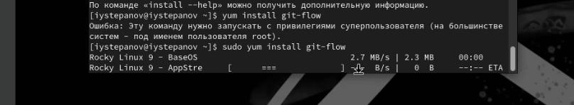
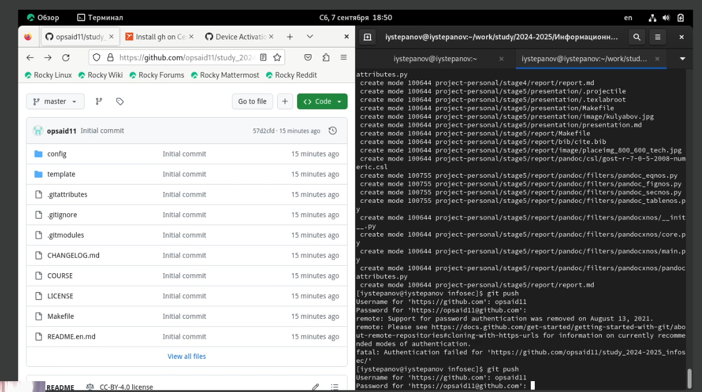

---
## Front matter
title: "Лабораторная работа №1"
subtitle: "Информационная безопасность"
author: "Степанов Иван Юрьевич"
institute: "Российский университет дружбы народов имени Патриса Лумумбы, Москва, Россия"
date: "2024"

## Generic otions
lang: ru-RU
toc-title: "Содержание"

## Bibliography
bibliography: bib/cite.bib
csl: pandoc/csl/gost-r-7-0-5-2008-numeric.csl

## Pdf output format
toc: true # Table of contents
toc-depth: 2
lof: true # List of figures
fontsize: 12pt
linestretch: 1.5
papersize: a4
documentclass: scrreprt
## I18n polyglossia
polyglossia-lang:
  name: english
  options:
	- spelling=modern
	- babelshorthands=true
polyglossia-otherlangs:
  name: english
## I18n babel
babel-lang: english
babel-otherlangs: english
## Fonts
mainfont: PT Serif
romanfont: PT Serif
sansfont: PT Sans
monofont: PT Mono
mainfontoptions: Ligatures=TeX
romanfontoptions: Ligatures=TeX
sansfontoptions: Ligatures=TeX,Scale=MatchLowercase
monofontoptions: Scale=MatchLowercase,Scale=0.9
## Biblatex
biblatex: true
biblio-style: "gost-numeric"
biblatexoptions:
  - parentracker=true
  - backend=biber
  - hyperref=auto
  - language=auto
  - autolang=other*
  - citestyle=gost-numeric
## Pandoc-crossref LaTeX customization
figureTitle: "Рис."
tableTitle: "Таблица"
listingTitle: "Листинг"
lofTitle: "Список иллюстраций"
lolTitle: "Листинги"
## Misc options
indent: true
header-includes:
  - \usepackage{indentfirst}
  - \usepackage{float} # keep figures where there are in the text
  - \floatplacement{figure}{H} # keep figures where there are in the text
---

# Цель работы

 - Настроить рабочее пространство для лабораторных работ, а также приобрести практические навыки установки ОС на виртуальную машину (virtualbox) и настройки минимально необходимых для дальнейшей работы сервисов
 - изучить применение средств контроля версий, освоить умения по работе с git.
 - научиться оформлять отчеты с помощью языка разметки markdown

# Задание

 - установить виртуальную машину и ОС на нее, далее всё настроить
 - установить git и настроить
 - сделать отчеты с помощью markdown

# Теоретическое введение

 - Virtualbox - платформа с помощью которой можно создавать и управлять виртуальными машинами.
 - git - система управления версиями с распределенной архитектурой.
 - markdown - язык разметки, созданный с целью обозначения форматрирования в простом тексте, пригодный для преобразования в языки для продвинутых публикаций.

# Выполнение лабораторной работы

Установка и настройка виртуальной машины (рис. [-@fig:001]) и ОС (рис. [-@fig:002])на ней, изначально были проблемы с производительностью, но после установки и некоторых настроек, я перенастроил виртуальную машину, и всё стало работать лучше

{#fig:001 width=70%}
{#fig:002 width=70%}

после проделанной работы выше с помощью команды dmesg я искал разные данные, которые просили найти в лабораторной работе, например процессор, тип памяти, кол-во памяти (рис. [-@fig:003])

{#fig:003 width=70%}

После я устанавливал (рис. [-@fig:004]) и настраивал гит (рис. [-@fig:005]), сначала я клонировал шаблон к себе, после начал его изменение, а также создал нужные папки и файлы с помощью makefile 

{#fig:004 width=70%}
{#fig:005 width=70%}

# Выводы
 Я смог установить виртуальную машину, научился ее настраивать, а также научился устанавливать ОС на виртуальную машину, изучил работу гит, а также научился использовать его для работы, и приобрел нужные навыки для оформления отчетов в markdown.

::: {#refs}
:::
